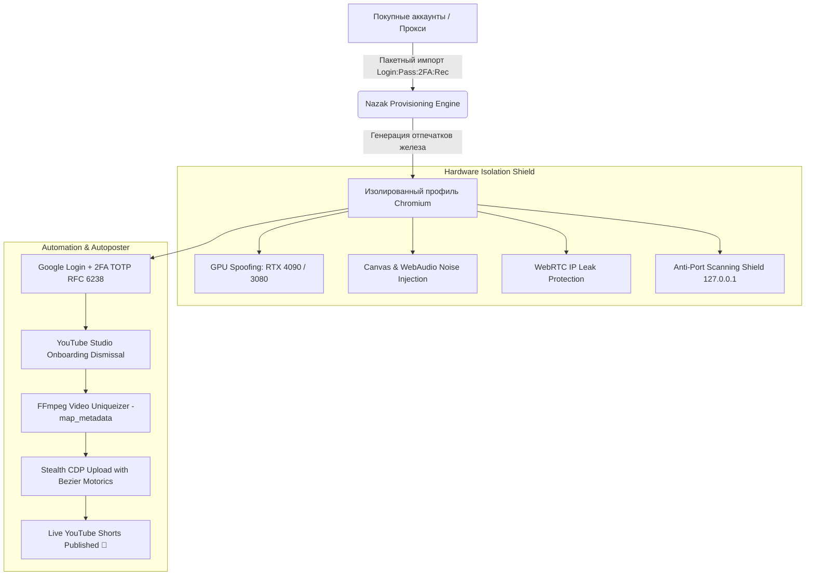

<div align="center">

# 🌐 Nazak Browser Studio PRO
### Next-Generation Hardware-Isolated Anti-Detect Browser, Google 2FA Automation & YouTube Shorts Stealth Autoposter

[](https://www.python.org/)
[](https://github.com/wwewtech/nazak-browser-studio)
[](https://qfluentwidgets.com/)
[](https://github.com/wwewtech/nazak-browser-studio)
[](LICENSE)

<p align="center">
  <b>100% Total Hardware Isolation</b> • <b>Live 2FA TOTP RFC 6238 Generator</b> • <b>FFmpeg Video Uniqueizer</b> • <b>Stealth CDP Bezier Motorics</b> • <b>Market Accounts Batch Importer</b>
</p>

[📥 **Скачать готовый EXE (v1.3.0 Release)**](https://github.com/wwewtech/nazak-browser-studio/releases) • [📖 Документация](#-архитектура-и-возможности) • [🚀 Быстрый старт](#-быстрый-старт) • [🧪 Тесты](#-тестовое-покрытие)

---

</div>

## 📸 Галерея интерфейса (Windows 11 Fluent Dark)

| Управление профилями (100% Изоляция) | YouTube Shorts Stealth Autoposter |
| :---: | :---: |
|  |  |

| Импорт и активация аккаунтов (Live 2FA) | Сетевая диагностика и Google Reachability |
| :---: | :---: |
|  |  |

---

## 📌 Архитектура и Возможности

**Nazak Browser Studio** — это профессиональный десктопный комбайн для Windows, объединяющий технологии глубокой аппаратной маскировки Chromium, массовое управление аккаунтами Google/YouTube и полностью автономный автопостинг контента.



---

### 🛡️ 1. Аппаратная маскировка (Total Hardware Shield)
- **Видеокарты реальных ПК**: Эмуляция *NVIDIA GeForce RTX 4090 / 4080 / 3080 / 3070*, *AMD Radeon RX 7900 XTX*, *Intel Iris Xe / UHD 770*.
- **Суб-перцептивный шум**:
  - `Canvas 2D Noise`: уникализация хэша холста на каждом профиле без артефактов на страницах.
  - `AudioContext Noise`: защита от снятия слепков звукового тракта через `AudioBuffer`.
  - `ClientRects Jitter`: защита от шрифтового фингерпринтинга.
- **Скрытие автоматизации**: Полное удаление `navigator.webdriver`, подмена `navigator.userAgentData` (Client Hints), `deviceMemory` (8-64 GB), `hardwareConcurrency` (4-32 cores).
- **Защита от утечек и сканирования портов**: Блокировка попыток антифрод-скриптов опрашивать порты локалхоста `127.0.0.1`, принудительная политика WebRTC `--force-webrtc-ip-handling-policy=disable_non_proxied_udp`.

---

### 🔑 2. Менеджер аккаунтов и встроенный 2FA TOTP Генератор
- **Пакетный импорт с любых маркетов (DarkStore, Retriv, AccsMarket)**:
  - Поддержка форматов `login:pass:2fa:recovery`, `login;pass;2fa;recovery`, `login|pass|2fa|recovery`, `login\tpass\t2fa\trec`.
  - Автоматическая очистка рекламных строк, чеков и ссылок.
- **Встроенный RFC 6238 TOTP Engine**:
  - Расшифровка секретных ключей Base32 любой длины (16, 24, 32, 52 символа) с авто-паддингом.
  - Тикающий в реальном времени таймер обновления 6-значных кодов прямо в таблице интерфейса.
- **Автоматическая сквозная авторизация**:
  - Автономный вход в Google аккаунты с прохождением экрана двухфакторной аутентификации.
  - Авто-обход модальных окон YouTube Studio (*"Welcome to Studio"*).

---

### 🎬 3. YouTube Shorts Stealth Autoposter & Video Uniqueizer
- **Глубокая уникализация видео через FFmpeg**:
  - Полное удаление метаданных (`-map_metadata -1`).
  - Микро-кроп (3%) с рескейлом в `1080x1920` (сбивает попиксельный хэш кадров).
  - Микрошум кадра (`noise=alls=2:allf=t`) и питч-сдвиг аудио на 1.5% (`asetrate + atempo`).
- **Спинтакс-генератор метаданных**:
  - Поддержка вложенных конструкций `{Лучший|Топ {1|2}} Shorts для {РФ|Мира} ⚡`.
  - Подстановка динамических тегов, ссылок на Telegram-боты `{tg}`, промокодов `{promo}` и года `{year}`.
- **Эмуляция человека по кривым Безье**:
  - Движение курсора мыши по физическим траекториям с ускорением, торможением и доводкой.
  - Посимвольный ввод текста с человеческими микропаузами (35–90 мс).

---

### 🌐 4. Прокси и 5-Этапная Диагностика
- Поддержка протоколов `HTTP`, `HTTPS`, `SOCKS4`, `SOCKS5` с авторизацией (динамическое расширение перехвата `chrome.webRequest.onAuthRequired`).
- **5-этапный Health Check**:
  1. TCP Ping & Latency (замер миллисекундного отклика).
  2. Определение внешнего IP, страны, города, провайдера (ISP), таймзоны и координат.
  3. Google Reachability Suite (проверка Google Search, Accounts, Ads, YouTube).
  4. Проверка прав на запись и целостности изолированного хранилища сессии.
  5. Проверка защиты от утечек WebRTC.

---

### 🔥 5. Органический автопрогрев аккаунтов (Warmup Bot)
- Автоматический серфинг по нишам:
  - **E-Commerce & Ритейл**
  - **Финансы & Инвестиции**
  - **IT & Разработка**
  - **Путешествия & Туризм**
  - **Криптовалюта & Web3**
- Нагул поисковой истории, куков и разгон Cookie Trust Score перед запуском рекламы или публикации.

---

## 🚀 Быстрый старт

### Вариант 1: Запуск готового EXE (Рекомендуется)
1. Скачайте архив из раздела [**Releases**](https://github.com/wwewtech/nazak-browser-studio/releases).
2. Распакуйте в любую удобную папку.
3. Запустите `NazakBrowserStudio.exe` (или `start_app.bat`).

### Вариант 2: Запуск из исходного кода
```powershell
# 1. Клонирование репозитория
git clone https://github.com/wwewtech/nazak-browser-studio.git
cd nazak-browser-studio

# 2. Установка зависимостей
pip install -r requirements.txt
playwright install chromium

# 3. Запуск GUI-приложения
python -m nazak.gui.main

# Или запуск локального веб-сервера
python -m nazak.main
```

---

## 💻 Использование через CLI

```powershell
# Список всех изолированных профилей
.\dist\NazakBrowserStudio\NazakBrowserStudio.exe list

# 5-этапная диагностика профиля
.\dist\NazakBrowserStudio\NazakBrowserStudio.exe check prof_01

# Запуск браузера с подменой железа и прокси
.\dist\NazakBrowserStudio\NazakBrowserStudio.exe launch prof_01

# Остановка работающего профиля
.\dist\NazakBrowserStudio\NazakBrowserStudio.exe stop prof_01

# Автоматический логин и залив тестового видео
python nazak/cli_auto_login_and_upload.py
```

---

## 🧪 Тестовое покрытие

Проект покрыт всесторонним набором из **271 автоматического теста**:

```powershell
python -m pytest -p no:asyncio tests -v
```

```
============================= 271 passed in 32.70s =============================
```

- `test_ui_ux_edge_cases.py` — стресс-тесты парсинга маркетов, регулярок поиска, спецсимволов и куков.
- `test_browser_cdp_resilience.py` — тесты генерации параметров Chrome, stealth.js, WebGL и жизненного цикла.
- `test_account_provisioner_edge_cases.py` — тесты RFC 6238 TOTP, OAuth 2.0, обновления токенов через прокси.
- `test_core_concurrency_and_storage.py` — тесты аварийного восстановления JSON, атомарных сохранений и клонирования.
- `test_ui_gui_and_fix_verification.py` — тесты устойчивости компонентов GUI, тумблеров и сохранения куков на диск.

---

## 📄 Лицензия

Распространяется под лицензией [MIT](LICENSE). Разработано для автоматизации арбитража трафика, управления фермами аккаунтов и безопасного создания контента.
