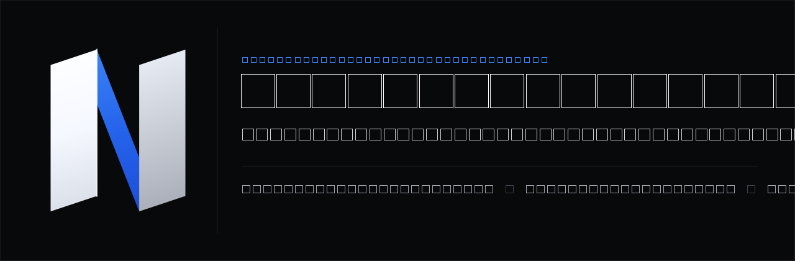
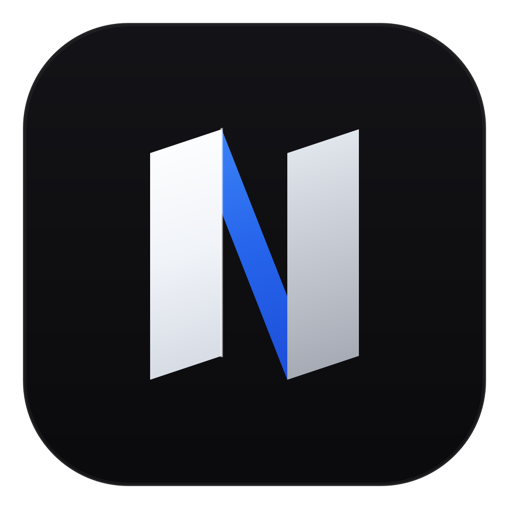
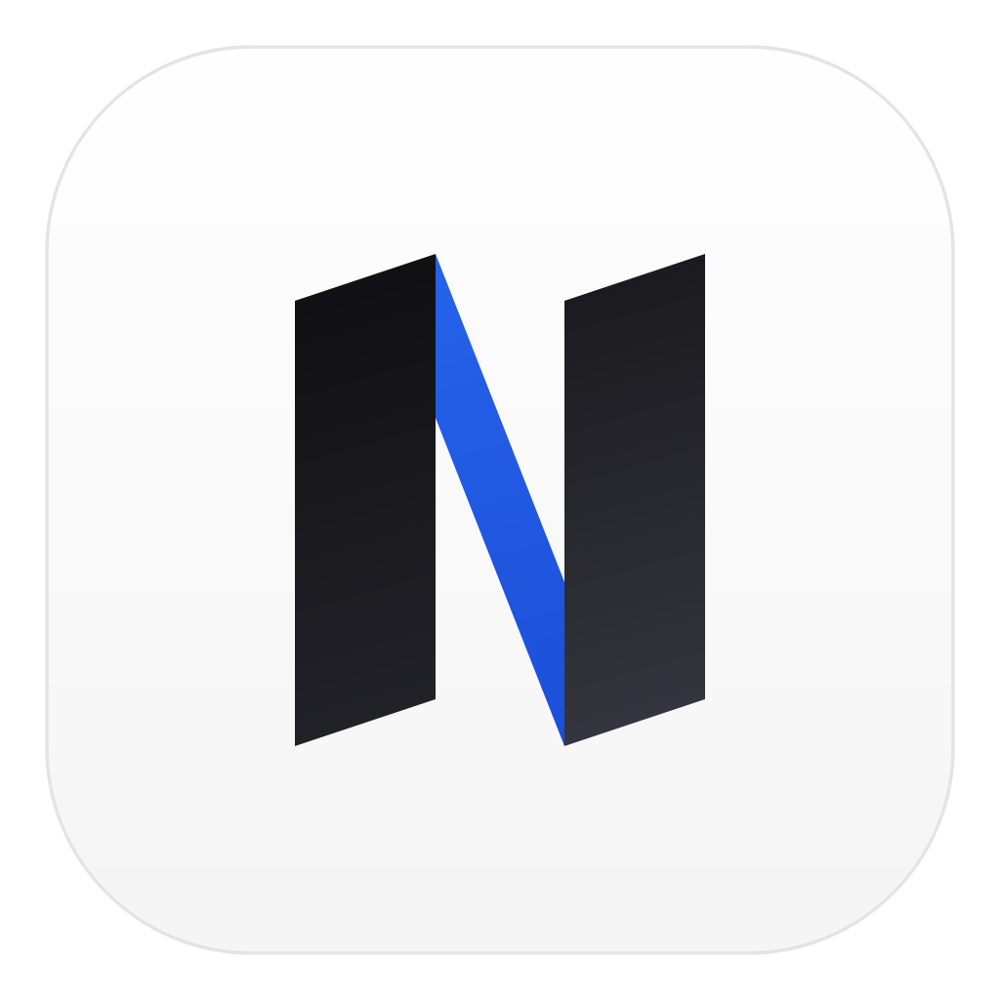
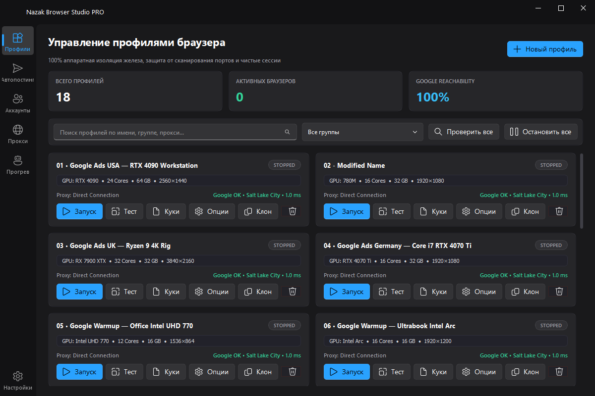
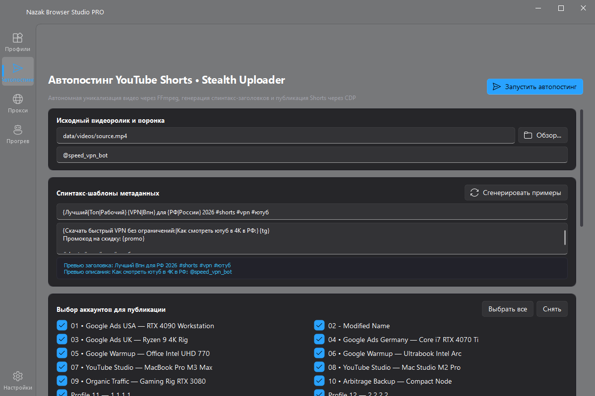
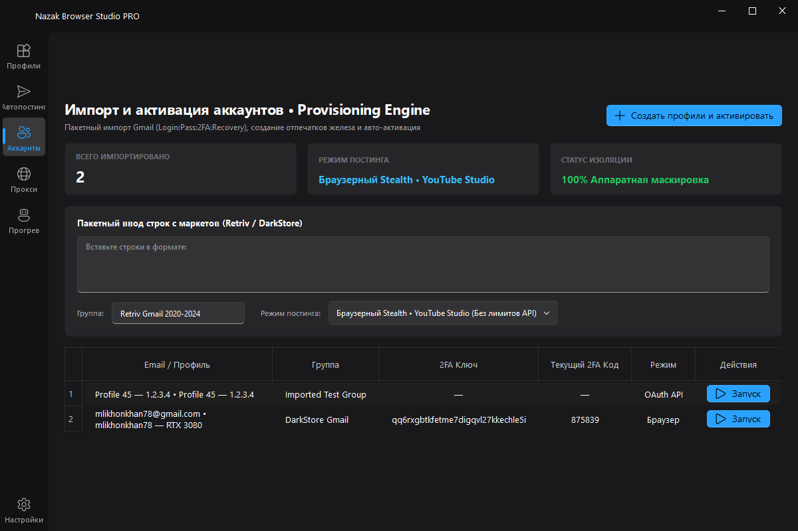
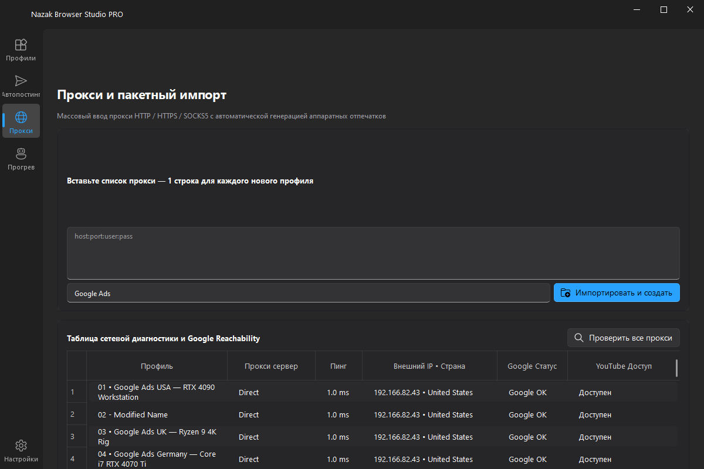
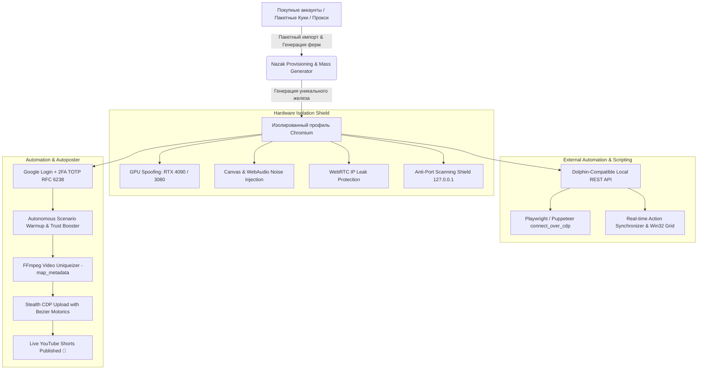

<div align="center">



<br><br>

<p align="center">
  
  &nbsp;&nbsp;&nbsp;&nbsp;&nbsp;&nbsp;&nbsp;&nbsp;
  
</p>

# 🌐 Nazak Browser Studio PRO
### Next-Generation Hardware-Isolated Anti-Detect Browser, Local Automation CDP API, Action Synchronizer, Scenario Warmup & YouTube Shorts Stealth Autoposter

[](https://www.python.org/)
[](https://github.com/wwewtech/nazak-browser-studio)
[](https://qfluentwidgets.com/)
[](https://github.com/wwewtech/nazak-browser-studio)
[](LICENSE)

<p align="center">
  <b>100% Free Dolphin{anty} Alternative</b> • <b>Local CDP Automation REST API</b> • <b>Batch Cookie Import/Export</b> • <b>Real-Time Action Synchronizer</b> • <b>Autonomous Scenario Warmup</b> • <b>Live 2FA TOTP RFC 6238 Generator</b> • <b>FFmpeg Video Uniqueizer</b> • <b>Stealth Bezier Motorics</b>
</p>

[📥 **Скачать готовый EXE (v1.4.0 Release)**](https://github.com/wwewtech/nazak-browser-studio/releases) • [📖 Документация](#-архитектура-и-возможности) • [🌐 **Полная REST API & Swagger Дока**](docs/API_REFERENCE.md) • [🤖 Local Automation API](#-local-automation-api--dolphinanty-parity) • [🚀 Быстрый старт](#-быстрый-старт) • [🧪 Тесты](#-тестовое-покрытие)

---

</div>

## 📸 Галерея интерфейса (Windows 11 Fluent Dark)

| Управление профилями (100% Изоляция) | YouTube Shorts Stealth Autoposter |
| :---: | :---: |
|  |  |

| Импорт и активация аккаунтов (Live 2FA) | Сетевая диагностика и Google Reachability |
| :---: | :---: |
|  |  |

---

## 📌 Архитектура и Возможности

**Nazak Browser Studio** — это профессиональный десктопный комбайн для Windows, объединяющий технологии глубокой аппаратной маскировки Chromium, массовое управление аккаунтами Google/YouTube, локальный API автоматизации для Playwright/Puppeteer/Selenium, синхронизатор действий и автономный автопостинг контента.



---

### 🤖 1. Local Automation API & Dolphin{anty} Parity
Позволяет любым внешним скриптам на Python, Node.js, Go или C# подключаться к прогретым профилям с уникальными отпечатками через стандартный протокол Chrome DevTools Protocol (CDP).

> 📘 **Интерактивный Swagger UI**: [`http://127.0.0.1:8899/docs`](http://127.0.0.1:8899/docs) или [`http://127.0.0.1:8899/swagger`](http://127.0.0.1:8899/swagger)  
> 📖 **Полная документация REST API**: [**`docs/API_REFERENCE.md`**](docs/API_REFERENCE.md)

#### 🔗 Совместимые эндпоинты Dolphin{anty} Local API:
- `GET /v1.0/browser_profiles` — список всех профилей со статусами и прокси.
- `GET /v1.0/browser_profiles/{profile_id}/start` — запуск профиля, динамическое выделение порта CDP и возврат `{ "success": True, "automation": { "port": 9222, "wsEndpoint": "ws://..." } }`.
- `GET /v1.0/browser_profiles/{profile_id}/stop` — остановка браузера.
- `GET /v1.0/browser_profiles/active` — получение списка всех активных браузеров с их CDP-портами.

#### 💡 Пример подключения через Playwright (Python):
```python
import requests
from playwright.sync_api import sync_playwright

# 1. Запуск изолированного профиля через Nazak API
resp = requests.get("http://localhost:8899/v1.0/browser_profiles/prof_01/start").json()
ws_endpoint = resp["automation"]["wsEndpoint"]

# 2. Подключение Playwright напрямую к профилю
with sync_playwright() as p:
    browser = p.chromium.connect_over_cdp(ws_endpoint)
    context = browser.contexts[0]
    page = context.pages[0] if context.pages else context.new_page()
    
    # Работаем со всеми куками, прокси и аппаратными отпечатками профиля!
    page.goto("https://www.google.com")
    print(page.title())
```

---

### 🍪 2. Пакетный импорт и экспорт куков (Batch Cookie Tool)
- **Универсальный парсер**:
  - Распознавание разделителей профилей: `=== Profile 01 ===`, `--- Name ---`, `[Profile Name]`.
  - JSON-карты `{ "Account_1": [...], "Account_2": [...] }`.
  - Авто-создание новых изолированных профилей на лету для ненайденных сессий.
- **Работа с папками и ZIP-архивами**:
  - Выбор папки с файлами `.json` / `.txt` (Netscape format).
  - Распаковка и загрузка многопрофильных `.zip` архивов.
  - Массовый экспорт всех или выбранных куков в структурированный ZIP-архив.

---

### ⚡ 3. Синхронизатор действий (Action Synchronizer & Window Grid)
- **Репликация действий в реальном времени**:
  - Управляйте одним главным профилем (**Master**) — все клики, нажатия клавиш, навигация и скролл мгновенно повторяются на десятках дочерних окон (**Workers**).
- **Антифрод-рандомизация (Humanizer)**:
  - Суб-пиксельное случайное смещение курсора мыши.
  - Временные задержки (20–80 мс) для исключения машинной синхронности.
- **Автоматическая сетка окон (Win32 Grid Tiling)**:
  - 1 клик для аккуратного раскладывания всех активных браузеров по экрану в матрицу 2×2, 3×3 или 4×4.

---

### 🔥 4. Конструктор сценариев и органический автопрогрев
- **Готовые многошаговые сценарии**:
  - **E-Commerce & Google Ads Trust Booster**: поиск электроники, скролл выдачи, клик по товарам, принятие cookie-баннеров.
  - **YouTube & Shorts Audience Warmup**: просмотр превью, скролл рекомендаций, воспроизведение видео.
  - **Crypto & Web3 Investor**: мониторинг CoinMarketCap, серфинг DeFi протоколов.
  - **Finance & High-CPC Banking**: сбор трастовых финансовых куков высшей ценовой категории.
- **Параллельное исполнение**:
  - Запуск сценариев по пулу профилей с контролем параллелизма (Concurrency Pool).

---

### 📦 5. Массовая генерация ферм и портативные бандлы (`.nazak`)
- **Массовая генерация**:
  - Создание от 1 до 100+ профилей в 1 клик.
  - Круговое распределение прокси (Round-Robin).
  - Смешанные отпечатки ОС (Windows 10/11, macOS Sequoia, Linux Ubuntu).
- **Портативные бандлы (`.nazak`)**:
  - Экспорт полного изолированного профиля (настройки железа + сессия + куки + расширения) в единый переносимый zip-пакет.
  - Мгновенный импорт на любом другом компьютере.

---

### 📱 6. Мобильные прокси и ссылки смены IP (IP Rotation)
- Поддержка ссылок ротации в форматах `host:port:user:pass:http://change-ip`, `host:port:user:pass|http://change-ip`, `[proxy]#[rotation_url]`.
- Кнопка **"Сменить IP"** прямо в таблице интерфейса и эндпоинт `POST /api/profiles/{id}/rotate-proxy`.

---

### 🛡️ 7. Аппаратная маскировка (Total Hardware Shield)
- **Видеокарты реальных ПК**: Эмуляция *NVIDIA GeForce RTX 4090 / 4080 / 3080 / 3070*, *AMD Radeon RX 7900 XTX*, *Intel Iris Xe / UHD 770*.
- **Суб-перцептивный шум**:
  - `Canvas 2D Noise`: уникализация хэша холста на каждом профиле без артефактов на страницах.
  - `AudioContext Noise`: защита от снятия слепков звукового тракта через `AudioBuffer`.
  - `ClientRects Jitter`: защита от шрифтового фингерпринтинга.
- **Скрытие автоматизации**: Полное удаление `navigator.webdriver`, подмена `navigator.userAgentData` (Client Hints), `deviceMemory` (8-64 GB), `hardwareConcurrency` (4-32 cores).
- **Защита от утечек и сканирования портов**: Блокировка попыток антифрод-скриптов опрашивать порты локалхоста `127.0.0.1`, принудительная политика WebRTC `--force-webrtc-ip-handling-policy=disable_non_proxied_udp`.

---

### 🔑 8. Менеджер аккаунтов и встроенный 2FA TOTP Генератор
- **Пакетный импорт с любых маркетов (DarkStore, Retriv, AccsMarket)**: `login:pass:2fa:recovery`
- **Встроенный RFC 6238 TOTP Engine**: Расшифровка Base32 любой длины с авто-паддингом и тикающим таймером.
- **Автоматическая сквозная авторизация**: Google Login + YouTube Studio Onboarding Dismissal.

---

### 🎬 9. YouTube Shorts Stealth Autoposter & Video Uniqueizer
- **Глубокая уникализация видео через FFmpeg**: `-map_metadata -1`, микро-кроп 3%, рескейл 1080x1920, кадр-шум, аудио питч-сдвиг.
- **Спинтакс-генератор**: `{Лучший|Топ} Shorts для {РФ|Мира} ⚡ {tg} {promo}`.
- **Эмуляция человека по кривым Безье**: Физические траектории мыши и посимвольный ввод текста.

---

## 🚀 Быстрый старт

### 🪟 Windows: Запуск готового EXE (Рекомендуется)
1. Скачайте архив из раздела [**Releases**](https://github.com/wwewtech/nazak-browser-studio/releases).
2. Распакуйте и запустите `NazakBrowserStudio.exe` (или `start_app.bat`).

---

### 🐍 Запуск из исходного кода (Python 3.10+)
```powershell
# Установка зависимостей
pip install -r requirements.txt
playwright install chromium

# Запуск нативного интерфейса
python -m nazak.main --mode gui

# Или запуск REST API и веб-студии
python -m nazak.main --mode web
```

---

## 🧪 Тестовое покрытие

Проект покрыт всесторонним набором из **293 автоматических тестов**:

```powershell
python -m pytest -p no:asyncio tests -v
```

```
============================ 293 passed in 24.03s =============================
```

- `test_local_automation_cdp_api.py` — тесты Dolphin{anty} Local API и CDP портов.
- `test_cookie_bulk_manager.py` — тесты пакетного импорта, папок, ZIP архивов и Netscape парсера.
- `test_synchronizer_engine.py` — тесты синхронизатора сессий и расположения окон Win32.
- `test_scenario_engine_and_warmup.py` — тесты конструктора сценариев и многошагового автопрогрева.
- `test_mass_profile_generator.py` — тесты массовой генерации ферм и уникализации отпечатков.
- `test_profile_bundle_portability.py` — тесты портативных `.nazak` бандлов.
- `test_proxy_rotation_and_mobile.py` — тесты мобильных ссылок смены IP.
- `test_account_provisioner_edge_cases.py` — тесты RFC 6238 TOTP, OAuth 2.0.
- `test_browser_cdp_resilience.py` — тесты генерации параметров Chrome и stealth.js.

---

## 📄 Лицензия

Распространяется под лицензией [MIT](LICENSE). Разработано для автоматизации арбитража трафика, управления фермами аккаунтов, локальной автоматизации через CDP и безопасного создания контента.

