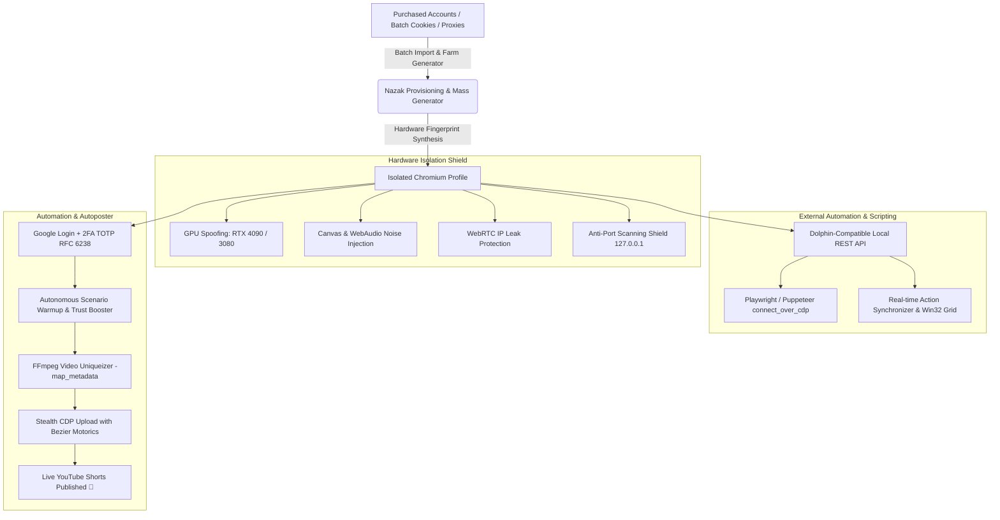

<div align="center">


<br><br>

<p align="center">
  
  &nbsp;&nbsp;&nbsp;&nbsp;&nbsp;&nbsp;&nbsp;&nbsp;
  
</p>

# 🌐 Nazak Browser Studio PRO
### Next-Generation Hardware-Isolated Anti-Detect Browser, Local Automation CDP API, Action Synchronizer, Scenario Warmup & YouTube Shorts Stealth Autoposter

[](https://www.python.org/)
[](https://github.com/wwewtech/nazak-browser-studio)
[](https://qfluentwidgets.com/)
[](https://github.com/wwewtech/nazak-browser-studio)
[](LICENSE)

<p align="center">
  <b>English</b> • <a href="README.md">Русский</a>
</p>

<p align="center">
  <b>100% Free Dolphin{anty} Alternative</b> • <b>Local CDP Automation REST API</b> • <b>Batch Cookie Import/Export</b> • <b>Real-Time Action Synchronizer</b> • <b>Autonomous Scenario Warmup</b> • <b>Live 2FA TOTP RFC 6238 Generator</b> • <b>FFmpeg Video Uniqueizer</b> • <b>Stealth Bezier Motorics</b>
</p>

[📥 **Download Portable EXE (v1.5.0 Release)**](https://github.com/wwewtech/nazak-browser-studio/releases) • [📖 Architecture & Features](#-architecture-and-features) • [🌐 **Complete REST API & Swagger Docs**](docs/API_REFERENCE.md) • [🤖 Local Automation API](#-1-local-automation-api--dolphinanty-parity) • [🚀 Quick Start](#-quick-start) • [🧪 Tests](#-test-coverage)

---

</div>

## 📸 Interface Gallery (Windows 11 Fluent Dark)

| Profile Management (100% Isolation) | YouTube Shorts Stealth Autoposter |
| :---: | :---: |
|  |  |

| Account Import & Provisioning (Live 2FA) | Network Diagnostics & Google Reachability |
| :---: | :---: |
|  |  |

---

## 📌 Architecture and Features

**Nazak Browser Studio** is an enterprise-grade desktop suite for Windows combining deep Chromium hardware spoofing, multi-account Google/YouTube farm management, local CDP automation REST API for Playwright/Puppeteer/Selenium, real-time action synchronization, and autonomous stealth content publishing.



---

### 🤖 1. Local Automation API & Dolphin{anty} Parity
Enables external automation scripts in Python, Node.js, Go, or C# to connect directly to warmed profiles with unique hardware footprints using the standard Chrome DevTools Protocol (CDP).

> 📘 **Interactive Swagger UI**: [`http://127.0.0.1:8899/docs`](http://127.0.0.1:8899/docs) or [`http://127.0.0.1:8899/swagger`](http://127.0.0.1:8899/swagger)  
> 📖 **Full REST API Documentation**: [**`docs/API_REFERENCE.md`**](docs/API_REFERENCE.md)

#### 🔗 Dolphin{anty} Compatible Local Endpoints:
- `GET /v1.0/browser_profiles` — list all profiles with live statuses, proxy info, and tags.
- `GET /v1.0/browser_profiles/{profile_id}/start` — start browser profile, dynamically allocate a free CDP port, and return `{ "success": true, "automation": { "port": 9222, "wsEndpoint": "ws://...", "ws_endpoint": "ws://..." } }`.
- `GET /v1.0/browser_profiles/{profile_id}/stop` — gracefully terminate browser instance.
- `GET /v1.0/browser_profiles/active` — inspect all actively running browsers and their CDP ports.

#### 💡 Playwright Connection Example (Python):
```python
import requests
from playwright.sync_api import sync_playwright

# 1. Launch isolated profile via Nazak Local API
resp = requests.get("http://localhost:8899/v1.0/browser_profiles/prof_01/start").json()
ws_endpoint = resp["automation"]["wsEndpoint"]

# 2. Connect Playwright directly over CDP
with sync_playwright() as p:
    browser = p.chromium.connect_over_cdp(ws_endpoint)
    context = browser.contexts[0]
    page = context.pages[0] if context.pages else context.new_page()
    
    # Fully operating with isolated cookies, proxy, and hardware fingerprints!
    page.goto("https://www.google.com")
    print(page.title())
```

---

### 🍪 2. Batch Cookie Management (Import / Export)
- **Universal Multi-Format Parser**:
  - Auto-detection of profile delimiters: `=== Profile 01 ===`, `--- Name ---`, `[Profile Name]`.
  - JSON maps `{ "Account_1": [...], "Account_2": [...] }`.
  - Auto-creation of new isolated browser profiles on the fly for unmapped sessions.
- **Folder and ZIP Archive Ingestion**:
  - Ingest folders containing `.json` or `.txt` (Netscape format) files.
  - Decompress and batch-load multi-profile `.zip` archives.
  - Bulk export selected or all profile cookies into a structured portable ZIP archive.

---

### ⚡ 3. Action Synchronizer & Window Grid
- **Real-Time Action Replication**:
  - Control a single primary profile (**Master**) — all mouse clicks, keystrokes, navigation events, and scrolls can be broadcasted to dozens of secondary profiles (**Workers**).
- **Anti-Detection Randomization (Humanizer)**:
  - Sub-pixel randomized cursor coordinate jitter.
  - Micro-delays (20–80 ms) eliminating robotic machine synchronicity.
- **Win32 Window Grid Tiling**:
  - 1-click automatic arrangement of all active browser windows into a balanced 2×2, 3×3, or 4×4 monitor grid.

---

### 🔥 4. Scenario Builder & Autonomous Warmup
- **Pre-Built Multi-Step Warmup Scenarios**:
  - **E-Commerce & Google Ads Trust Booster**: organic Google searches, SERP dwell time, product browsing on marketplaces, cookie consent dialog acceptance.
  - **YouTube & Shorts Audience Warmup**: feed scrolling, preview dwell, organic video viewing sessions.
  - **Crypto & Web3 Investor Farming**: CoinMarketCap browsing, DeFi protocol exploration, crypto whitepaper dwell.
  - **Finance & High-CPC Banking Footprint**: accumulation of premium Tier-1 financial advertising cookies.
- **Concurrent Execution Pool**:
  - Batch launch scenarios across profile clusters with fine-grained concurrency control (`max_concurrency`).

---

### 📦 5. Mass Farm Generator & Portable Bundles (`.nazak`)
- **Mass Profile Generation**:
  - Create 1 to 100+ fully isolated profiles in 1 click.
  - Automatic Round-Robin proxy assignment across the pool.
  - Authentic OS distribution (Windows 10/11, macOS Sequoia, Linux Ubuntu).
- **Portable `.nazak` Bundles**:
  - Export complete browser profile state (hardware fingerprints, storage sessions, cookies, extensions) into a single portable `.nazak` package.
  - Instant one-click import on any workstation with zip-slip traversal protection.

---

### 📱 6. Mobile Proxies & IP Rotation Links
- Support for rotation URLs in multiple formats: `host:port:user:pass:http://change-ip`, `host:port:user:pass|http://change-ip`, `[proxy]#[rotation_url]`.
- Direct **"Rotate IP"** trigger button in GUI tables and via REST endpoint `POST /api/profiles/{id}/rotate-proxy`.

---

### 🛡️ 7. Total Hardware Shield
- **Real GPU Hardware Emulation**: *NVIDIA GeForce RTX 4090 / 4080 / 3080 / 3070*, *AMD Radeon RX 7900 XTX*, *Intel Iris Xe / UHD 770*.
- **Sub-Perceptual Noise Injection**:
  - `Canvas 2D Noise`: per-profile canvas hash uniqueization without visual artifacts.
  - `AudioContext Noise`: protects against sound processing fingerprinting via `AudioBuffer`.
  - `ClientRects Jitter`: protects against font-measurement fingerprinting.
- **Automation Cloaking**: Complete elimination of `navigator.webdriver`, spoofing of `navigator.userAgentData` (User-Agent Client Hints), `deviceMemory` (8–64 GB), and `hardwareConcurrency` (4–32 cores) in the MAIN execution world.
- **Port Scanning & Leak Protection**: Blocks anti-fraud port scanning targeting localhost `127.0.0.1`, enforces strict WebRTC policy `--force-webrtc-ip-handling-policy=disable_non_proxied_udp`.

---

### 🔑 8. Account Provisioner & Built-In RFC 6238 2FA TOTP Engine
- **Batch Import from All Major Marketplaces (DarkStore, Retriv, AccsMarket)**: `login:pass:2fa:recovery`.
- **Integrated RFC 6238 TOTP Engine**: Base32 secret decoding with dynamic auto-padding and real-time OTP calculation.
- **Autonomous End-to-End Authentication**: Automated Google sign-in and dismissal of YouTube Studio onboarding prompts.

---

### 🎬 9. YouTube Shorts & Instagram Reels Stealth Autoposter & Video Uniqueizer
- **Deep FFmpeg Video Uniqueization**: Strips metadata (`-map_metadata -1`), applies 3% micro-crop, 1080×1920 vertical conform, imperceptible frame noise, and subtle audio pitch/tempo shift.
- **Spintax Title & Description Generator**: `{Best|Top} Shorts/Reels for {Tech|Crypto} ⚡ {tg} {promo}`.
- **Unified Multi-Platform Pipeline**: Single workflow orchestrating autonomous uploads for both YouTube Shorts and Instagram Reels with humanized Bezier mouse trajectory motorics and character-by-character typing.

---

## 🚀 Quick Start

### 🪟 Windows: Pre-Built Binary (Recommended)
1. Download the latest release from the [**Releases**](https://github.com/wwewtech/nazak-browser-studio/releases) section.
2. Extract the archive and launch `NazakBrowserStudio.exe` (or `start_app.bat`).

---

### 🐍 Running from Source (Python 3.10+)
```powershell
# Install requirements
pip install -r requirements.txt
playwright install chromium

# Launch Native Windows 11 Fluent GUI
python -m nazak.main --mode gui

# Or launch headless REST API and Web Studio
python -m nazak.main --mode web
```

---

## 🧪 Test Coverage

The project is backed by a comprehensive regression and unit test suite comprising **492 automated tests**:

```powershell
python -m pytest tests -q
```

```
============================ 492 passed in 83.93s =============================
```

- `test_deep_security_and_traversal.py` — 25 security tests: `validate_pid` path traversal defense, Zip-Slip vulnerability protection, CORS localhost regex restrictions, CLI credential masking.
- `test_deep_storage_and_concurrency.py` — 25 concurrency & persistence tests: atomic `profiles.json` write via RLock & unique tmp files, batch save coalescing, process lifecycle monitor transitions.
- `test_deep_fingerprint_and_stealth.py` — 25 fingerprint & stealth tests: `json.dumps` escaping in `stealth.js`, `MAIN` world content script execution context, Canvas, WebGL, WebRTC, Audio, Battery, Client Hints emulation.
- `test_deep_api_and_scenarios.py` — 25 API & scenario integration tests: bidirectional Netscape cookie roundtrip fidelity, warmup scenario aliases, Dolphin{anty} Local API parity, asynchronous `httpx` synchronizer.
- `test_audit_regression.py` — 21 regression tests covering all 23 findings from AUDIT_REPORT.md (C1-C5, H1-H11, M1-M8, I1).
- `test_local_automation_cdp_api.py` — Dolphin{anty} parity API and CDP port tests.
- `test_cookie_bulk_manager.py` — batch cookie import, folder/zip handling, and Netscape parser tests.
- `test_synchronizer_engine.py` — session synchronizer and Win32 grid layout tests.
- `test_scenario_engine_and_warmup.py` — multi-step warmup scenarios and concurrency tests.
- `test_mass_profile_generator.py` — mass generation and hardware uniqueization tests.
- `test_profile_bundle_portability.py` — portable `.nazak` bundle export/import tests.
- `test_proxy_rotation_and_mobile.py` — mobile proxy rotation link tests.
- `test_account_provisioner_edge_cases.py` — RFC 6238 TOTP engine and OAuth tests.
- `test_browser_cdp_resilience.py` — Chrome parameter synthesis and stealth extension tests.

---

## 📄 License

Distributed under the [MIT License](LICENSE). Engineered for high-throughput traffic arbitrage, account farm orchestration, local CDP browser automation, and stealth content publishing.
